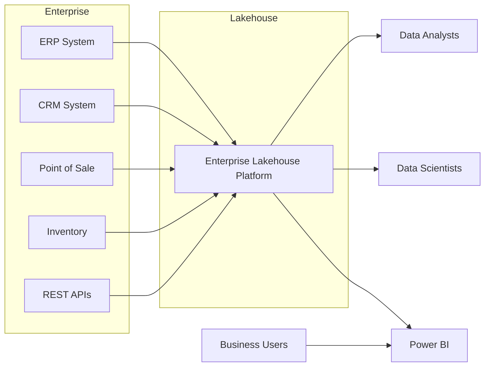
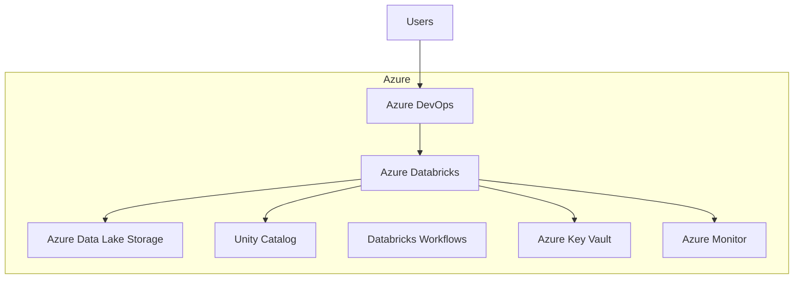
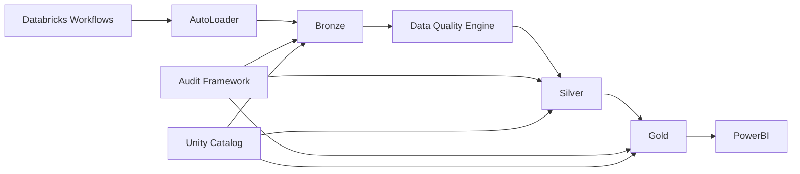
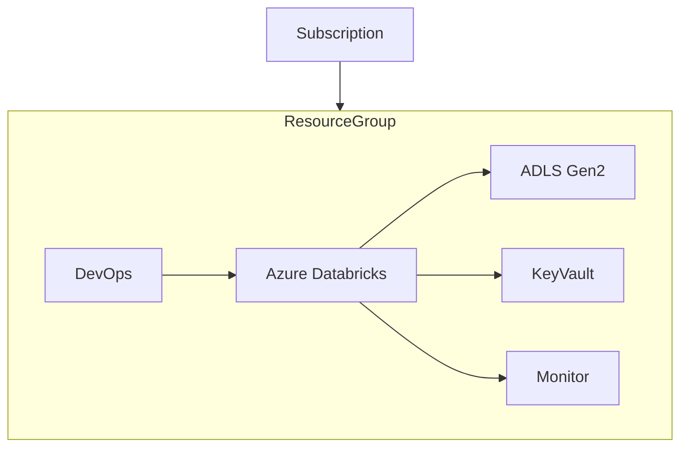
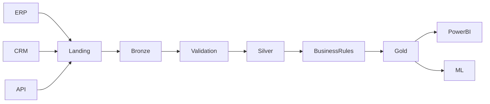
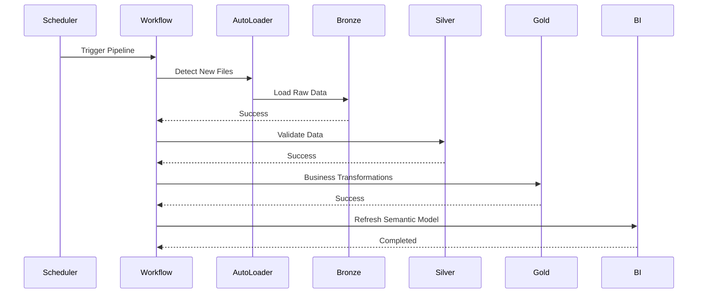
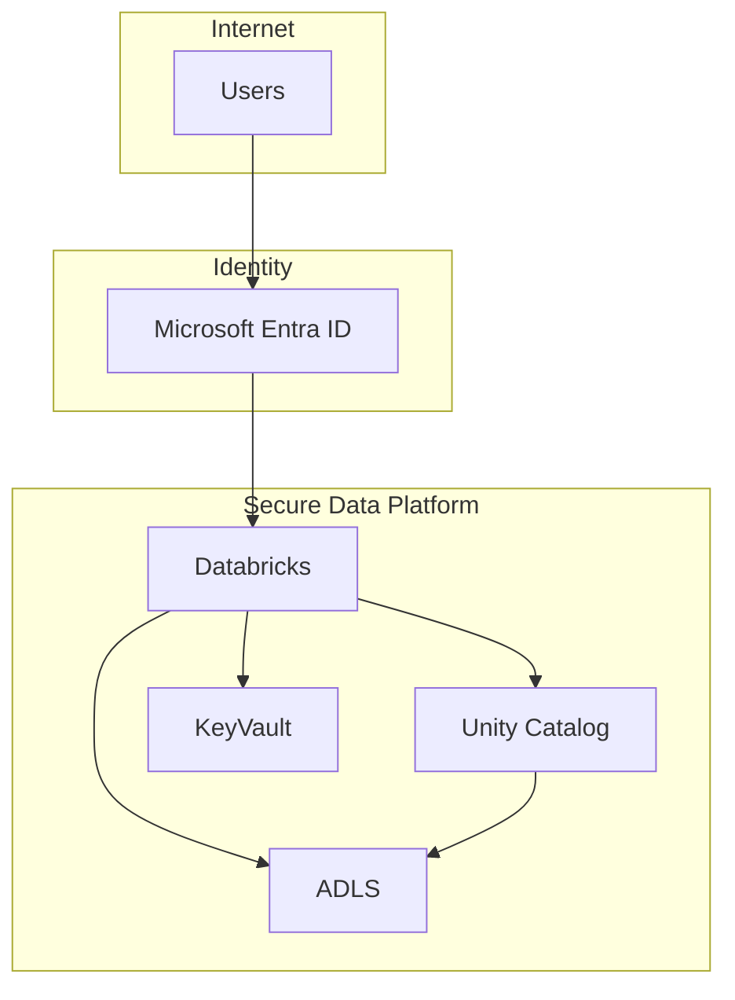
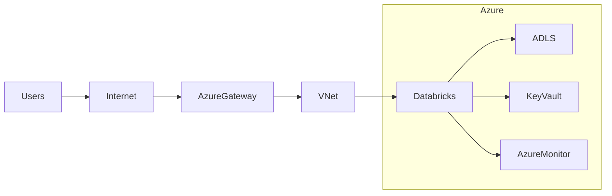

# 04.2 - Architecture Diagrams

**Project:** Enterprise Lakehouse Platform

**Version:** 1.0

**Architecture Style:** C4 Model + Enterprise Data Engineering

**Author:** Sanjay K J

---

# Purpose

This document contains the architectural views of the Enterprise Lakehouse Platform.

The diagrams follow the C4 Model to describe the system from different abstraction levels while also including additional enterprise data engineering views such as data flow, security boundaries, deployment topology, and networking.

---

# Architecture Diagram Index

| Section | Diagram |
|----------|----------|
| C1 | System Context Diagram |
| C2 | Container Diagram |
| C3 | Component Diagram |
| D1 | Deployment Diagram |
| D2 | Data Flow Diagram |
| D3 | Pipeline Sequence Diagram |
| D4 | Security Trust Boundary Diagram |
| D5 | Network Architecture Diagram |

---

# C1 – System Context Diagram

## Objective

Shows how the Enterprise Lakehouse Platform interacts with external actors and systems.

---

# C2 – Container Diagram

## Objective

Shows the major containers inside the platform.

---

# C3 – Component Diagram

## Objective

Shows the internal components of the Databricks platform.

---

# D1 – Deployment Diagram

## Objective

Shows where the solution is deployed.

---

# D2 – Data Flow Diagram

## Objective

Illustrates end-to-end data movement.

---

# D3 – Pipeline Sequence Diagram

## Objective

Illustrates runtime execution.

---

# D4 – Security Trust Boundary Diagram

## Objective

Illustrates security zones and trust boundaries.

---

# D5 – Network Architecture Diagram

## Objective

Illustrates network connectivity.

---

# Architecture Layers

| Layer | Responsibility |
|--------|----------------|
| Presentation | Power BI, Databricks SQL |
| Consumption | Gold Layer |
| Business | Business Rules |
| Processing | Silver Layer |
| Ingestion | Bronze Layer |
| Storage | Azure Data Lake |
| Governance | Unity Catalog |
| Monitoring | Azure Monitor |
| Security | Entra ID, Key Vault |
| DevOps | Azure DevOps |

---

# Diagram Traceability

| Diagram | Purpose |
|----------|----------|
| C1 | Business View |
| C2 | Platform View |
| C3 | Internal Databricks Components |
| D1 | Deployment Topology |
| D2 | Data Movement |
| D3 | Runtime Execution |
| D4 | Security Architecture |
| D5 | Network Connectivity |

---

# Summary

These diagrams collectively describe the Enterprise Lakehouse Platform from multiple architectural perspectives.

The C4 Model provides increasing levels of detail—from external context to internal platform components—while the deployment, networking, security, and data flow diagrams address enterprise operational concerns required for production-grade data platforms.

These diagrams serve as the architectural blueprint for the subsequent Low-Level Design (LLD) documents.