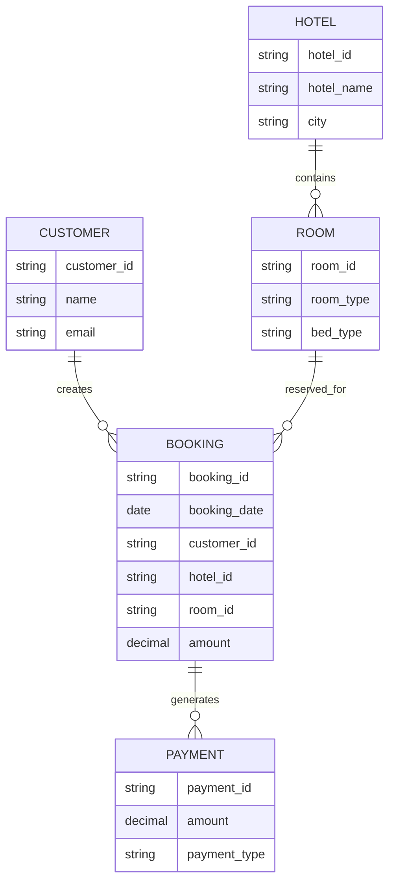
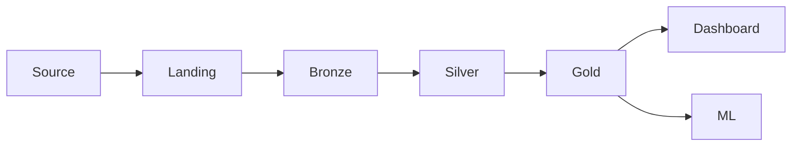
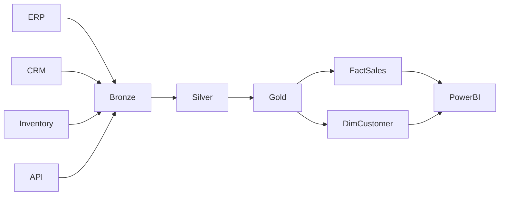
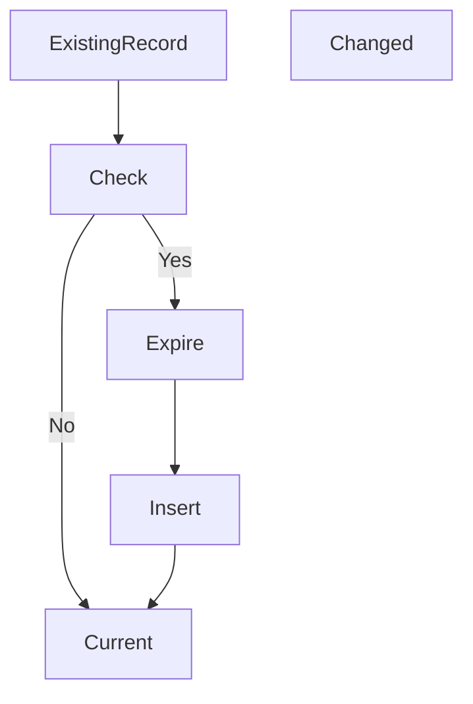
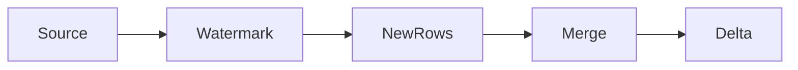
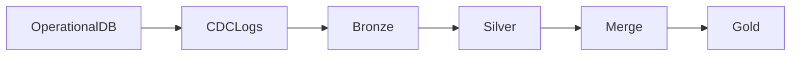
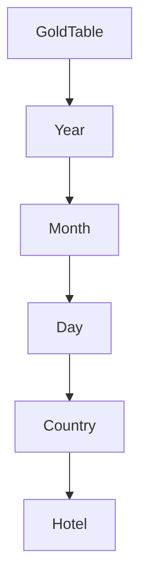
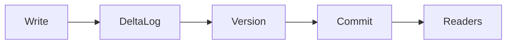
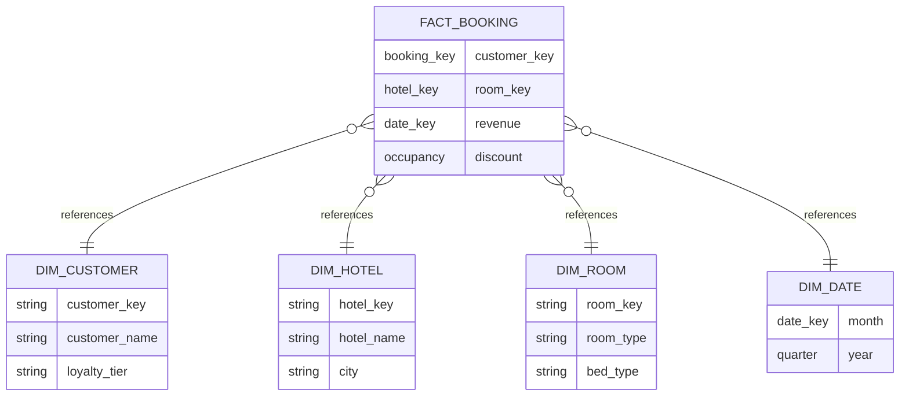

# 04.3 - Data Model Diagrams

**Project:** Enterprise Lakehouse Platform

**Version:** 1.0

**Author:** Sanjay K J

---

# Purpose

This document describes the logical data model used throughout the Enterprise Lakehouse Platform.

Unlike infrastructure architecture, these diagrams focus on how business data is organized, transformed, governed, and consumed.

The objective is to provide a clear understanding of:

- Enterprise entities
- Relationships
- Medallion Architecture
- Data lineage
- Slowly Changing Dimensions (SCD)
- Incremental processing
- Change Data Capture (CDC)
- Partitioning strategy
- Delta Lake transaction lifecycle

---

# Diagram Index

| ID | Diagram |
|----|----------|
| DM-01 | Enterprise ER Diagram |
| DM-02 | Medallion Layer Mapping |
| DM-03 | Data Lineage |
| DM-04 | Slowly Changing Dimension Flow |
| DM-05 | Incremental Load Strategy |
| DM-06 | Change Data Capture (CDC) |
| DM-07 | Partition Strategy |
| DM-08 | Delta Lake Transaction Flow |
| DM-09 | Enterprise Star Schema |

---

# DM-01 Enterprise ER Diagram

## Purpose

Represents the core business entities.



---

# DM-02 Medallion Layer Mapping

## Purpose

Shows how data evolves through the Lakehouse.



### Responsibilities

| Layer | Purpose |
|--------|----------|
| Bronze | Raw immutable data |
| Silver | Cleansed & standardized |
| Gold | Business-ready analytics |

---

# DM-03 Data Lineage Diagram

## Purpose

Illustrates lineage from source systems to business reports.



---

# DM-04 Slowly Changing Dimension (SCD Type 2)

## Purpose

Preserves historical changes to dimension attributes.



### Example

```
Customer

Customer Name

Address

Effective Date

End Date

Current Flag
```

Historical versions remain available.

---

# DM-05 Incremental Load Strategy

## Purpose

Loads only new or modified records.



### Strategy

Incremental loads use:

- Last Modified Timestamp
- Watermark Table
- MERGE INTO
- Idempotent Processing

---

# DM-06 Change Data Capture (CDC)

## Purpose

Captures inserts, updates, and deletes.



Supported events

- INSERT
- UPDATE
- DELETE

---

# DM-07 Partition Strategy

## Purpose

Illustrates physical partitioning.



### Partition Keys

- Business Date
- Country
- Region
- Market
- Hotel

---

# DM-08 Delta Lake Transaction Flow

## Purpose

Illustrates ACID transactions.



### Delta Features

- ACID
- Time Travel
- Schema Evolution
- Versioning
- Rollback
- Optimistic Concurrency

---

# DM-09 Enterprise Star Schema

## Purpose

Represents the analytical model exposed to BI tools.



---

# Data Modeling Standards

The platform follows these principles:

- Immutable raw data
- Schema enforcement
- Delta Lake ACID guarantees
- Slowly Changing Dimensions (Type 2)
- Metadata-driven transformations
- Surrogate keys in dimensions
- Fact/Dimension modeling for analytics
- Incremental and idempotent processing
- Partition pruning for performance

---

# Summary

These diagrams define the logical data architecture of the Enterprise Lakehouse Platform.

Together they illustrate how operational data is ingested, modeled, transformed, governed, and exposed for analytics while preserving historical accuracy, scalability, and performance.